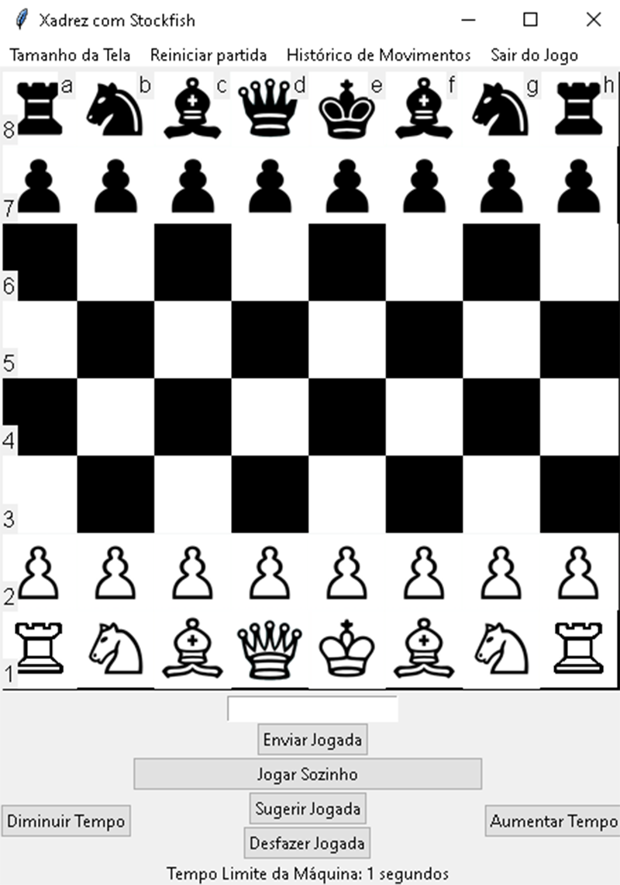
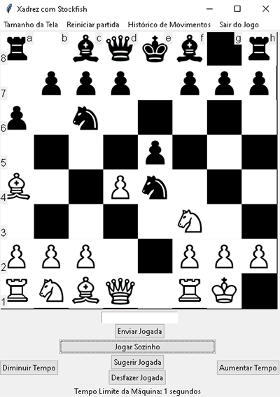

# PythonChess


Este é um projeto de xadrez em Python que utiliza a biblioteca Tkinter para a interface gráfica e o motor de xadrez Stockfish para as jogadas.

## Recursos

- Interface gráfica intuitiva.
- Suporte para jogar contra um oponente humano ou contra o Stockfish.
- Análise de jogadas com a ajuda do Stockfish.
- Histórico de movimentos.
- Contagem de movimentos, xeques, xeque-mate e empates.
- Personalização do nível de dificuldade do Stockfish.

## Capturas de Tela

<div style="display: flex; flex-direction: row;">
  
  
</div>


## Como Jogar

1. **Clone o repositório:**

```markdown
git clone https://github.com/JoaoAndrade18/PythonChess.git
```

2. **Instale as dependências:**

```markdown
pip install -r requirements.txt
```

3. Compile o Stockfish:

```markdown
Em desenvolvimento...
```

4. Execute o Main.py

```markdown
python Main.py
```

## Como Jogar - Botões e Recursos
Quando você executar o PythonChess, terá acesso a vários botões e recursos na interface gráfica. Aqui está o significado de cada um deles:

Reiniciar partida: Inicia um novo jogo de xadrez.
Salvar jogo: Permite salvar um estado do jogo. Em desenvolvimento... 
Carregar Jogo: Permite carregar um jogo salvo anteriormente. Em desenvolvimento...
Desfazer Jogada: Desfaz o último movimento no jogo.
Sugerir jogada: Ativa o motor de xadrez Stockfish para te indicar a melhor jogada.
Histórico de Movimentos: Exibe o histórico completo de todos os movimentos realizados durante a partida, onde na esquerda é das peças brancas.
Tamanho da Tela: Permite redimensionar a janela para tamanhos predefinidos.
Sair do jogo: Fecha o jogo PythonChess.
Jogar Sozinho: O motor Stockfish irá fazer todas as jogadas baseadas na melhor possivel, sem interações do usuário.
Diminuir e Aumentar tempo: Modifica a profundidade do tempo que o Stockfish irá escolher o melhor movimento.

## Contribuindo

Se você gostaria de contribuir para este projeto, por favor siga as diretrizes de contribuição descritas em [CONTRIBUTING.md](CONTRIBUTING.md).

## Licença

Este projeto está licenciado sob a Licença MIT - veja o arquivo [LICENSE](LICENSE) para mais detalhes.


